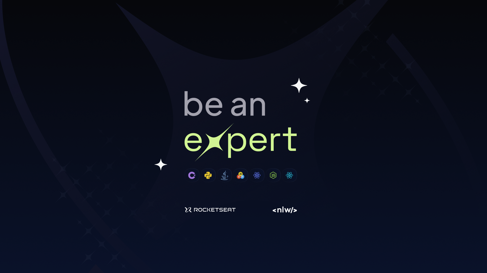

<h1 align="center">NLW Expert - Java</h1>

  

## Project

REST API to take certification exams.

## Features

- REST API;

## Technologies and Libraries

- Windows 10 Home | 22H2
- [Visual Studio Code | 1.89.1](https://code.visualstudio.com/)
- Java 17
- Maven 3.9.6
- [WSL 2] Ubuntu 22.04.3 LTS
- Docker 26.0.2
- Docker Compose 2.26.1
- PostegreSQL 16.2
- Insomnia 9.2.0

## Database

  

## License

This project is under the MIT license. See the [LICENSE](LICENSE.md) file for more details.